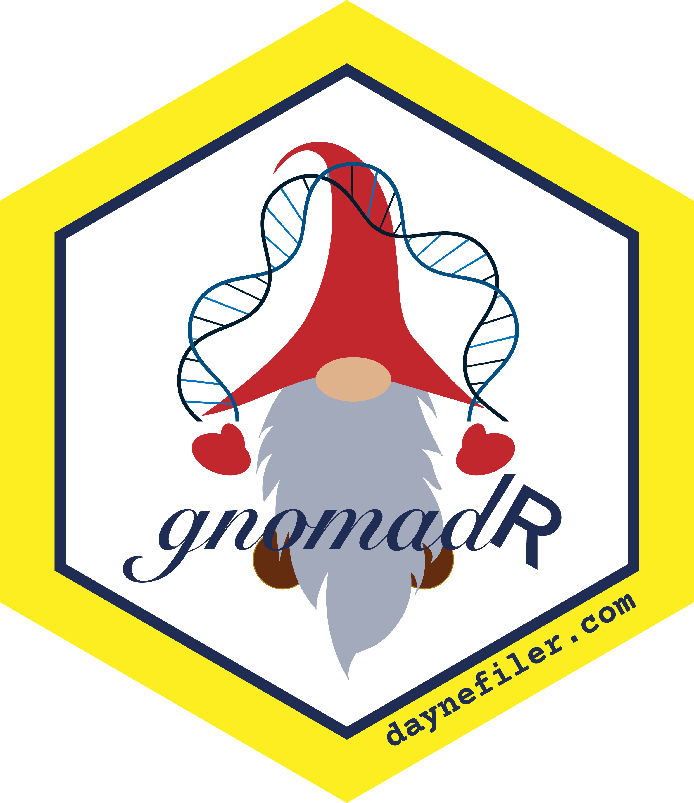

## gnomadR: Query gnomAD API from R 

This package intends to provide an interface between R and the [gnomAD](https://gnomad.broadinstitute.org/) API, powered by [GraphQL](https://graphql.org). This package utilizes the [qhql](https://docs.ropensci.org/ghql/) R package to send queries to gnomAD. 

*Currently, the gnomAD API hsa very low query size limits, limiting the utility.*

I would happily welcome contributions or requests for query functionality.
